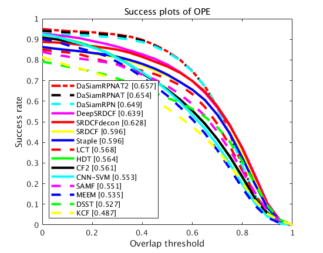

# DaSiamRPNAT

## Prerequisities

- python3
- pytorch
- numpy
- opencv
- matlab

## Data Preparation

### download OTB dataset

```
cd dataset
./download.sh
```

### extract zips

```
cd dataset
./extract.sh
```

### collect image path and ground truth

```
cd scripts
python pre_data_otb.py
```

Then, a file named `vot-otb.pkl` will appear in the folder `data`. It contains the image file path and ground truth.

## Pretrained model

SiamRPNBIG.model: https://drive.google.com/file/d/1-vNVZxfbIplXHrqMHiJJYWXYWsOIvGsf/view?usp=sharing

## run

### Baseline: DaSiamRPN
```
cd DaSiamRPN
python main.py
```

Then, a file named `DaSiamRPN.json` will appear in the folder `results`. It records the results.

### DaSiamRPNAT
```
cd DaSiamRPNAT
python main.py
```

Then, a file named `DaSiamRPNAT.json` will appear in the folder `results`.

### DaSiamRPNAT2
```
cd DaSiamRPNAT2
python main.py
```

Then, a file named `DaSiamRPNAT2.json` will appear in the folder `results`.

## benchmark

### convert json to mat

```
cd scripts
python generate_mat.py -i ../results/DaSiamRPN.json -n DaSiamRPN
python generate_mat.py -i ../results/DaSiamRPNAT.json -n DaSiamRPNAT
python generate_mat.py -i ../results/DaSiamRPNAT2.json -n DaSiamRPNAT2
```

### run benchmark

In the folder `otb-toolkit`, run matlab. Then, run `run_OPE` in matlab.
```
cd otb-toolkit
matlab
```

In matlab:
```
>> run_OPE
```

A plot will appear.



## Reference

- DaSiamRPN: https://github.com/foolwood/DaSiamRPN
- benchmark results: https://github.com/foolwood/benchmark_results
- DAT: https://github.com/shipubupt/NIPS2018
- otb-toolkit: https://github.com/ZhouYzzz/otb-toolkit
- SiamRPN: https://github.com/zkisthebest/Siamese-RPN